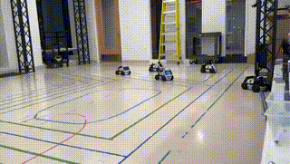

# Smartcity

This work proposes an event-triggered Control-Barrier-Function Quadratic-Programming framework that coordinates connected automated vehicles through highway-merge zones: each vehicle solves a QP only when a formally defined safety event looms, cutting the number of optimizations roughly in half and eliminating up to 86 % of infeasible cases versus fixed-period control. Despite the lower computational and V2V-communication burden, the scheme preserves travel-time and energy-optimal trajectories, rigorously guarantees forward-invariant rear-end and merge-point safety constraints, and operates in fully decentralized fashion with sparse state packets relayed over a 5 G LAN. A five-robot hardware test bed built on ROS and OptiTrack confirms real-time feasibility, smoother traffic flow, measurable energy savings, and robustness to sensor noise and delays; the same barrier-function set can be adapted to intersections or roundabouts, and open-source MATLAB / ROS modules are provided for easy replication and extension. 

### Rear-End Path Demo

### Merging Scenario Demo

